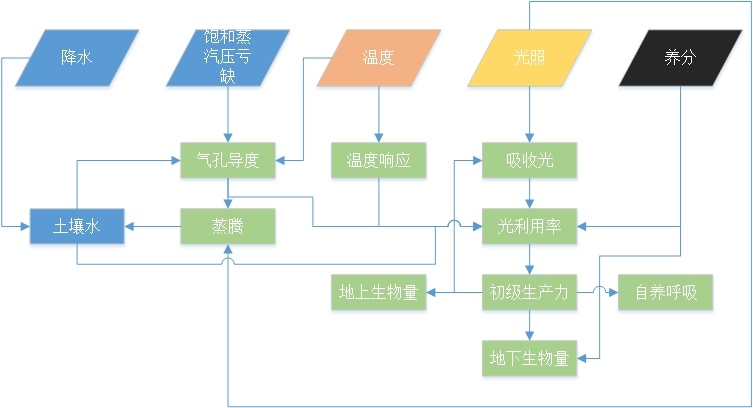
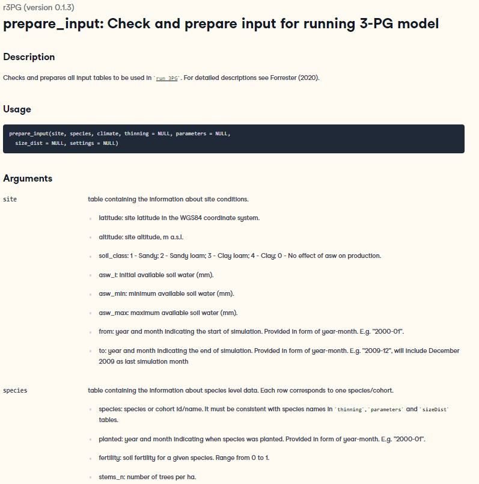

```{r setup, include=FALSE}
knitr::opts_chunk$set(echo = TRUE)
```

## 1.模型简介

**P**hysiological **P**rocesses **P**redicting **G**rowth （3PG）模型首先发表于Landsberg and Warning (1997)。<https://www.sciencedirect.com/science/article/pii/S0378112797000261>

3PG的主要用途是根据简单的生理参数预测**森林**生产力及蒸腾。其基本原理是利用光照和光利用率计算GPP。其中光利用率受温度、湿度、土壤水分、土壤养分、树龄、二氧化碳浓度影响。

模型的主要特点有：1.完备的植物生理过程；2.科学的气候变化响应；3.动态的树木组成；4.相对简单易用。

3PG的时间尺度为月，空间尺度可以自定。模型必要的气象参数有：光照、降水、温度、湿度。模型使用的植物生理参数82个。另需林地初始状态参数54个。

使用3PG的相关研究遍布世界各地。目前已超过100篇。


图一。使用3PG模型的研究的世界分布。


与3PG学习的相关资料很多。在本课程外，还可参阅网站
<https://3pg.forestry.ubc.ca/>

由于应用广泛，3PG有许多版本，涉及不同编程语言。本期课程将使用R语言中的r3PG包：
<https://doi.org/10.1111/2041-210X.13474>

## 2.基本结构
3PG的结构与多数生态系统模型和陆面模式类似。其基本假设为植物吸收光照转化为生物量，并按一定比例用于叶、茎、根的生长。



图2。简要的3PG流程图。


3PG可以分为水分利用、水胁迫、温度响应、光利用、植物生长、养分胁迫六大部分。 


虽然，模型牵涉很多，各部分相互影响，但是，可以看出模型各部分的实际目的都是为了预测生产力。

## 3.运行环境
我们选用R语言<https://www.r-project.org/>，并用RStudio<https://www.rstudio.com/>作为操作界面。具体安装在相关网站有详细方法。在此不赘述。

简单来说R是一款为数据处理和统计专门开发的开源语言。它现有的相关功能包覆盖大多数常用编程需求。因此，R已成为最常用的科学编程语言。

我们本次只使用‘r3PG’ 相关的内容。安装方法如下：

```{r message=F}
# 安装
if(require('r3PG') == FALSE){
  install.packages('r3PG')
} 

# 调用
library('r3PG')
```

## 4.基本操作

### 4.1 使用帮助页面

R的基本操作之一是找到相对应的功能包和函数的帮助页面。

```{r eval=F,message=F}
# 功能包介绍
help(package = r3PG)
```

也可以直接查看帮助内容。

```{r}
# 内容列表介
ls("package:r3PG")
```

### 4.2 查看数据结构

对于数据，则可查看前几行的情况以获得大致了解。也可用tail或者summary。

```{r}
# 内容查看-输入
head(d_climate)
```

```{r}
# 内容查看-参数结构
head(i_parameters)
```

### 4.3 查看函数功能

此处我们具体查看prepare_input这一函数的用法。此函数可以帮助我们整理输入文件格式。

```{r eval=F,message=F}
# 内容查看-函数
?prepare_input
```



以上内容即为该函数的帮助文档。

### 4.5 模型试运行

所有参数和函数都是为了方便模型的运行。在此，我们已经可以运行3PG模型。此处的例子，是功能包自带的数据。

```{r}
# 运行模型
output <- run_3PG(site = d_site,#站点相关信息，初始土壤水
                  species = d_species,#树种相关信息，初始生物量
                  climate = d_climate,#气象因子
                  thinning = d_thinning,#间苗
                  parameters = d_parameters,#按树种的生理参数
                  size_dist = d_sizeDist,#修正大小分布
                  settings = list(light_model = 1, 
                                  transp_model = 2, phys_model = 2,
                                  correct_bias = 0, calculate_d13c = 0),
                  check_input = TRUE, df_out = TRUE)


head(output)
```

我也可以查看模型具体的预测。以下是初级生产力变化实例。

```{r}
# 作图
plot(value~date,data = output[output$species == 'Fagus sylvatica' &
                                output$variable == 'gpp',],
     type='l',xlab='',ylab='GPP',col='grey')

points(value~date,data = output[output$species == 'Pinus sylvestris' &
                                output$variable == 'gpp',],
     type='l',xlab='',ylab='GPP',col='red')

legend('topleft',legend = unique(output$species),
       lty='solid',col=c('grey','red'),bty='n')
```


## 5 模型输入输出

下面我们整理一下3PG所需要的输入输出数据。首先，是所需参数。

### 表1。3PG所需参数列表。

```{r message=F, echo=FALSE}
library(knitr)
kable(i_parameters)
```

### 表2。3PG所需气象数据列表。

```{r message=F, echo=FALSE}
kable(data.frame(Variable = c('year','month','tmp_min','tmp_max','prcp','srad','frost_days','co2'),
                 Discription = c('year','month','monthly mean daily minimum temperature',
                                 'monthly mean daily maximum temperature','monthly rainfall ',
                                 'monthly mean daily solar radiation','frost days per month',
                                 'monthly mean atmospheric co2'),
                 Unit = c('-','-','Celsius','Celsius','mm month-1','MJ m-2 d-1',
                          'day','p.p.m')))
```

### 表3。3PG所需站点数据列表。

```{r message=F, echo=FALSE}
kable(data.frame(Variable = c('latitude','altitude','soil_class','asw_i','asw_min','asw_max','from','to'),
                 Discription = c(' ',' ','1 - Sandy; 2 - Sandy loam; 3 - Clay loam; 4 - Clay; 0 - No effect',
                                 'initial available soil water',
                                 'minimum available soil water ',
                                 'maximum  available soil water ',
                                 'start of simulation',
                                 'end of simulation'),
                 Unit = c('-','-','-','mm','mm','mm',
                          'mm','YYYY-mm')))
```

### 表4。3PG植物及初始信息数据列表。

```{r message=F, echo=FALSE}
kable(data.frame(Variable = c('species','planted','fertility','stems_n',
                              'biom_stem','biom_root','biom_foliage'),
                 Discription = c(' ','year and month indicating when species was planted',
                                 'soil fertility for a given species',
                                 'number of trees per ha',
                                 'stem biomass for a given species',
                                 'root biomass for a given species',
                                 'initial foliage biomass'),
                 Unit = c('-','-','0-1','No./ha','Mg/ha','Mg/ha',
                          'Mg/ha')))
```

### 表5。3PG植物自然稀疏信息列表。

```{r message=F, echo=FALSE}
kable(data.frame(Variable = c('species','age','stems_n',
                              'stem','root','foliage'),
                 Discription = c(' ','age when thinning is performed',
                                 'number of trees per ha after thinning',
                                 'type of thinning (above/below)',
                                 'type of thinning (above/below)',
                                 'type of thinning (above/below)')))
```

### 表6。3PG输出信息列表。

```{r message=F, echo=FALSE}
kable(i_output)
```

## 6.功能模块-生产力计算

### 6.1 光利用-生产力
在3PG中，初级生产力直接有多个环境变量及参数计算得出。
$$
GPP = Qf_l(L) \alpha f_t(T)f_w(W)f_g(g_s)~~~~~~~~(1)
$$

### 6.2 光照

光照强度(Q)有多种度量方式。注意3PG需要的是月日均光照（monthly mean daily solar radiation），单位是$MJ~m^{-2}~d^{-1}$。因为模型实际需要月尺度数据，实际模型在计算时，会先换算成月总光照。


### 6.3 叶面积指数
光照首先受到现有植被叶面积指数（L）的影响：
$$f_l = (1-e^{-kL})~~~~~~~~(2)$$
这一关系由Beer–Lambert定律支持。此处，一般假设k=0.5。

```{r message=FALSE, warning=FALSE}
# 生产力与光照
lai.vec <- seq(0,10,by=0.1)
plot.df <- data.frame(lai = lai.vec,
                      f.low = 1-exp(-0.5*lai.vec))

plot(f.low~lai,data = plot.df,
     type='p',pch=16,xlab='L',ylab=expression(f[l]),col='grey',
     ylim=c(0,1))

```

一般情况下，这一方程不需要调整参数。但是，叶面积指数受到比叶面积（SLA）影响。因此，要特别注意比叶面积数值。

### 6.4 光能利用率

光能利用率（$\alpha$）是基于不同物种的重要参数。它的基本意义是每单位太阳辐射对应的碳吸收（$g~MJ^{-1}$）。$\alpha$的重要性体现在它代表了生产力对于光照的线性关系。

```{r message=FALSE, warning=FALSE}
# 生产力与光照
plot.df <- data.frame(q = 1:10,
                      GPP.low = (1:10) * 2,
                      GPP.high = (1:10) * 3)

plot(GPP.low~q,data = plot.df,
     type='p',pch=16,xlab='Radiation',ylab='GPP',col='grey',
     ylim=c(0,30))

points(GPP.high~q,data = plot.df,
     type='p',pch=16,xlab='',col='red')

legend('topleft',legend = c('LOW','HIGH'),
       pch=16,col=c('grey','red'),bty='n')
```

以上是3PG的最根本性假设，至此我们已经可以计算初级生产力：

```{r message=FALSE, warning=FALSE}
# 生产力计算
# 参数
par.dummy.df <- data.frame(species = c('x1','x2'),
                      lai = c(0.5,2),
                      alpha = c(2,3))
# 光照
met.dummy.df <- data.frame(date = seq(as.Date('2000-1-1'),
                                      as.Date('2000-12-31'),by='month'),
                           solar = 10*sin((1:12)/12*pi))
# 日均换算月均
dayInMonth = 30
# 计算GPP
met.dummy.df$gpp.x1 <- par.dummy.df$alpha[par.dummy.df$species=='x1']*
  (1-exp(-0.5*par.dummy.df$lai[par.dummy.df$species=='x1']))*
  met.dummy.df$solar * dayInMonth

met.dummy.df$gpp.x2 <- par.dummy.df$alpha[par.dummy.df$species=='x2']*
  (1-exp(-0.5*par.dummy.df$lai[par.dummy.df$species=='x2']))*
  met.dummy.df$solar * dayInMonth
# 作图
plot(gpp.x1~date,data = met.dummy.df,
     type='p',pch=16,xlab=' ',ylab='GPP',col='grey',
     ylim=c(50,600))
points(gpp.x2~date,data = met.dummy.df,
     type='p',pch=16,ylab=expression(f[l]),col='red')

legend('topleft',legend = c('Species_1','Species_2'),
       pch=16,col=c('grey','red'),bty='n')
```

### 6.5 温度

温度的直接影响是：
$$f_t = \frac{T_{mean} - T_{min}} {T_{opt} - T_{min}}  (\frac{T_{max} - T_{mean}} {T_{max} - T_{opt}})^{\frac{T_{max} - T_{opt}}{T_{opt} - T_{min}}}~~~~~~~~(3)$$
这是一种常用的单参数温度方程。它的基本假设是温度的影响越接近适宜温度（$T_{opt}$）越小。

```{r message=FALSE, warning=FALSE}
# 温度
tmin= 0
tmax=45
t.vec <- seq(tmin,tmax,by=0.1)
# 计算
t.func <- function(t.vec,t.opt,t.max,t.min){
  (t.vec - t.min) / (t.opt - t.min) * 
    ((t.max-t.vec) / (t.max-t.opt))^((t.max-t.opt)/(t.opt - t.min))
}

ft20 <- t.func(t.vec,t.opt = 20,t.max = tmax,t.min = tmin)
ft30 <- t.func(t.vec,t.opt = 30,t.max = tmax,t.min = tmin)

plot(ft20~t.vec,
     type='l',xlab=expression(T~(degree*C)),
     ylab=expression(f[T]),col='grey',
     ylim=c(0,1))

points(ft30~t.vec,
     type='l',pch=16,xlab='',col='red')
abline(v=20,col='grey',lty='dashed')
abline(v=30,col='red',lty='dashed')
```

### 6.6 土壤水
土壤含水量对于光利用率的影响与土壤类型有关。具体参见Lansberg and Warning （1997）:


### 6.7 气孔导度

不同于很多其他基于Farquhar模型的日尺度模型，3PG的气孔导度是直接由饱和蒸气压亏缺（D; kPa）计算的出的。

$$g_{s} = g_{s.max}e^{1-k_{g}D}~~~~~~~~(4)$$

其中$g_{s.max}$和$k_{g}$是根据不同植物种类变化的参数。目前，一般假定$k_{g}=2.5$ 而仅使用$g_{s.max}$。

```{r message=FALSE, warning=FALSE}
# VPD
gmax1= 0.1
vpd.vec <- seq(0,4,by=0.1)

# 计算
vpd.func <- function(vpd,gmax,k = 1.9){
  exp(-1.9*vpd)
}

f.g.1 <- vpd.func(vpd.vec,gmax = gmax1)

plot(f.g.1~vpd.vec,
     type='l',xlab=('D (kPa)'),
     ylab=expression(f[D]),col='grey',
     ylim=c(0,1))
```

```{r}
# 运行模型
par.df <- get_parameters(mode = 'full',sp_names = 'Eucalyptus globulus')
par.df <- subset(par.df,select = -c(parset_id,age,type,year,region,
                                    country,notes,source,source_comments,
                                    source_full,link))
library(doBy)
par.df.sum <- summaryBy(.~species ,data = par.df,
                        FUN=mean,na.rm=T,keep.names=T)

long.df <- as.data.frame(t(subset(par.df.sum,select = -species)))
names(long.df) <- 'Eucalyptus globulus'
```

### 6.8 霜冻、树龄及土壤养分
3PG可以计算霜冻、树龄和养分不足造成的生长下降。其计算方式十分简单。对于霜冻，即在发生霜冻的时间按固定比例减少初级生产力。树龄则同样使生产力非线性下降。而营养不足除了按比例减少初级生产力，还会改变植物生物量分配。这些关系较为简单且使用时改变较小，故不作深入讨论。

### 6.9 二氧化碳响应
与其他响应类似，3PG的二氧化碳响应也是由响应方程定义。其中，首要的参数是二氧化碳的促进参数：

$$ f_{c}=\frac{f_{Calpha700}} {(2-f_{Calpha700})} ~~~~~~~~(5)$$

这一变化率直接用于计算光利用率的变化：

$$ f_{alpha,CO_{2}}=\frac{f_{c} CO_{2}} {(350(f_{c}-1)+CO_{2}} ~~~~~~~~(6)$$
```{r}
plot.co2.response.func <- function(fc.700 = 1.8,add.plot=FALSE){
  co2 <- seq(350,700)
fC = fc.700 / (2 - fc.700)
falpha = fC * co2 / (350* (fC - 1) + co2)
if(add.plot){
  points(falpha~co2,type='l',col='red',lwd=3)
}else{
  plot(falpha~co2,xlab='CO2',ylab='CO2 factor',type='l',ylim=c(1,2),lwd=3)
}

}
plot.co2.response.func(fc.700 = 1.2)
plot.co2.response.func(fc.700 = 1.8,add.plot = T)
```


## 7.功能模块-水分利用及植物生长
### 7.1 从降水到蒸腾
3PG假设土壤水均匀分布在给定深度内。降水先经过冠层截留，剩余部分全部进入土壤中。

土壤中的水分有两种流失途径：蒸腾和蒸发。这两种途径都是通过Penman-Monteith 方程计算，仅是参数不同。

这一简化的PM方程结构如下：

$$E= \frac{g_{c}}{\lambda} \frac{e_{20} R_{net} + \rho_{air} \lambda / r_{aero} }{g_{c}(1+e_{20}) + 1/r_{aero}} d_{length}~~~~~~~~(5)$$
此处，E是蒸腾或者蒸发的能量，单位是$kg~m^{-2}h^{-1}$ 顾需要考虑每月日数转化为月总量。$g_{c}$ 是冠层导度（$kg~m^{-2}h^{-1}$），注意对于蒸发则使用土壤导度。两者计算方式不同。$\lambda$是水汽化热（2460000$J~kg^{-1}$）。$e_{20}$是简化的饱和蒸气压对温度的斜率（2.2$kPa~ ^\circ C^{-1}$）。$R_{net}$是净辐射能量（$MJ~m^{-2}~h^{-1}$）。$R_{net}$计算较为复杂，此处简化为总辐射乘以$f_l$。$\rho_{air}$是空气密度（1.2$kg~m^{-3}$）。$r_{aero}$是空气阻力（$h~kg^{-1}$），即界面层导度的倒数。$d_{length}$是每日小时数。

对于多树种混杂的情况，则按照每种树的L分别计算蒸腾。而蒸发则是不考虑树种而是用L之和。

**若某月蒸散失大于土壤水分和降水之和，则假定所有可用水分即为蒸散失的实际值。并按照实际和计算值的比例减少初级生产力。**

### 7.2 植物生长
植物的生长与初级生产力线性相关。模型一般假设一个固定的自养呼吸比例（47%）。剩余的光合作用产物则全部用于生长。

3PG以根生长为优先。每月新增生物量的实际分配在给定的最大和最小根配机率之间，由每种树给定的土壤养分比例（0-1）决定。剩余生物量按比例分配给茎生长。最后剩余部分全部用于叶生长。根茎叶各有独立的凋亡比例。每月生长和凋亡的净值决定了实际生物量变化。

叶面积指数L为叶生物量与比叶面积之积。


## 8.相关文献

案例

 Trotsiuk et al., 2020. Assessing the response of forest productivity to climate extremes in Switzerland using model–data fusion, GCB. <https://doi.org/10.1111/gcb.15011>
 
模型

Landsberg, J. J., & Waring, R. H., 1997. A generalised model of forest productivity using simplified concepts of radiation-use efficiency, carbon balance and partitioning. Forest Ecology and Management, 95(3), 209–228. doi: 10.1016/S0378-1127(97)00026-1

使用手册

Sands, P. J., 2010. 3PGpjs user manual. Available at the following web site: https://3pg.sites.olt.ubc.ca/files/2014/04/3PGpjs_UserManual.pdf
